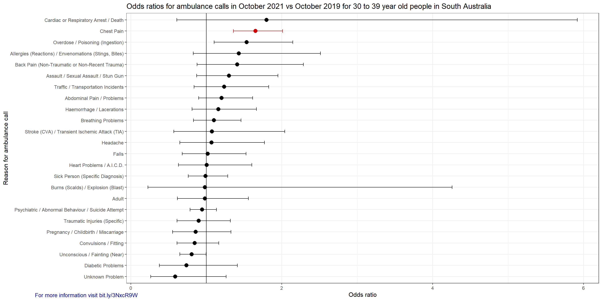
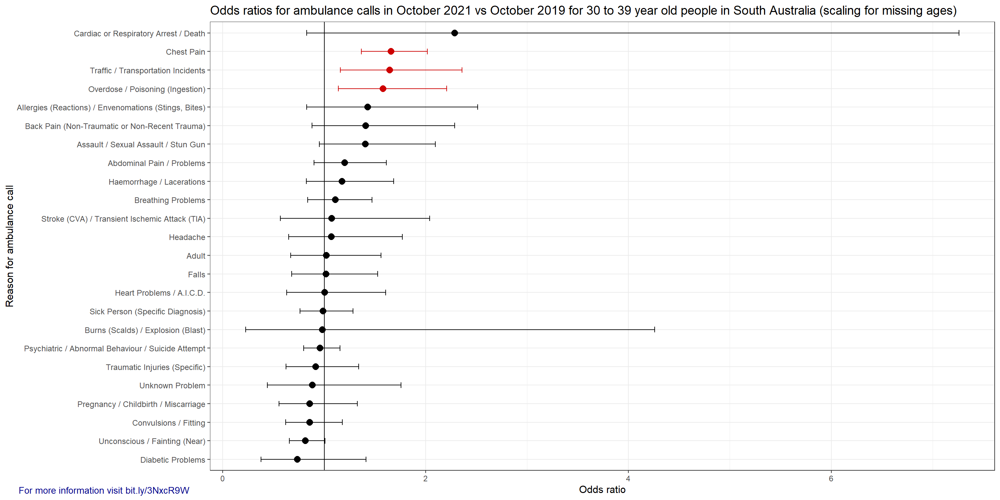
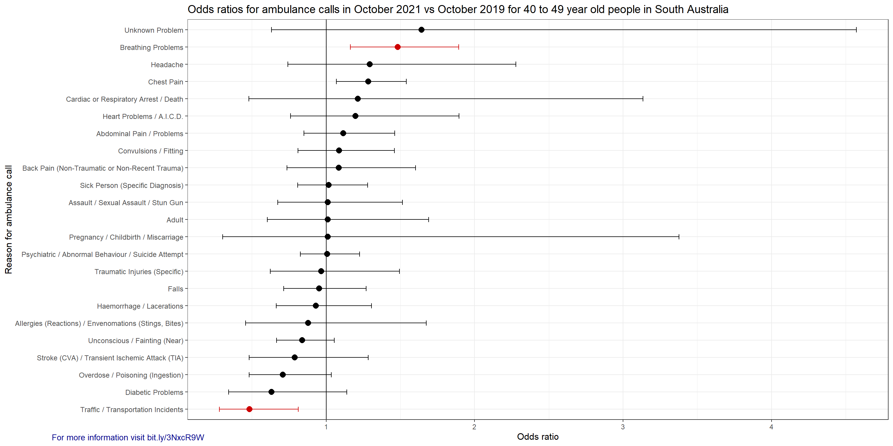
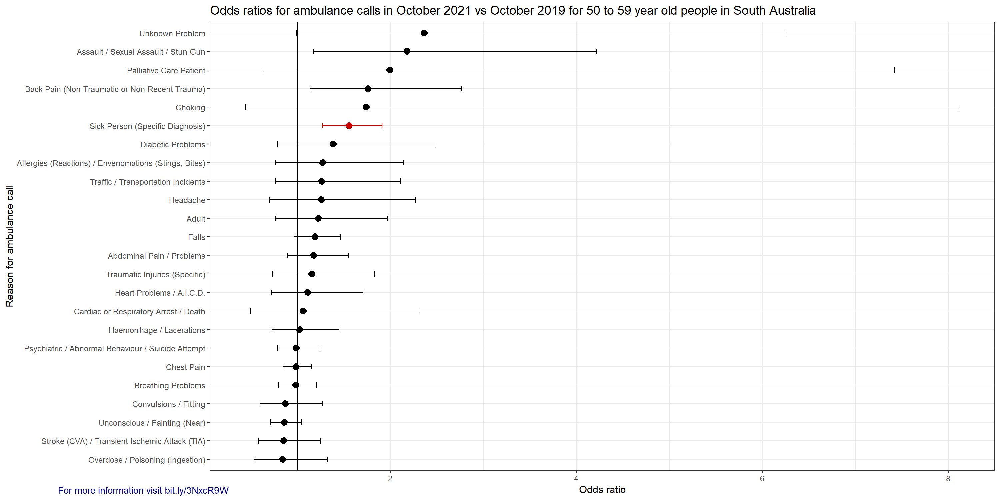
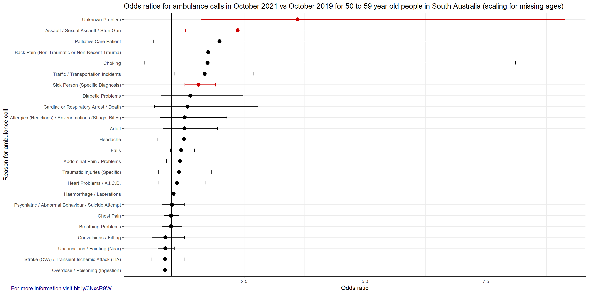
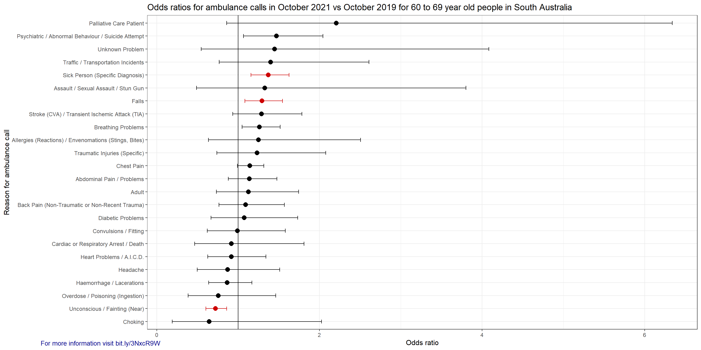
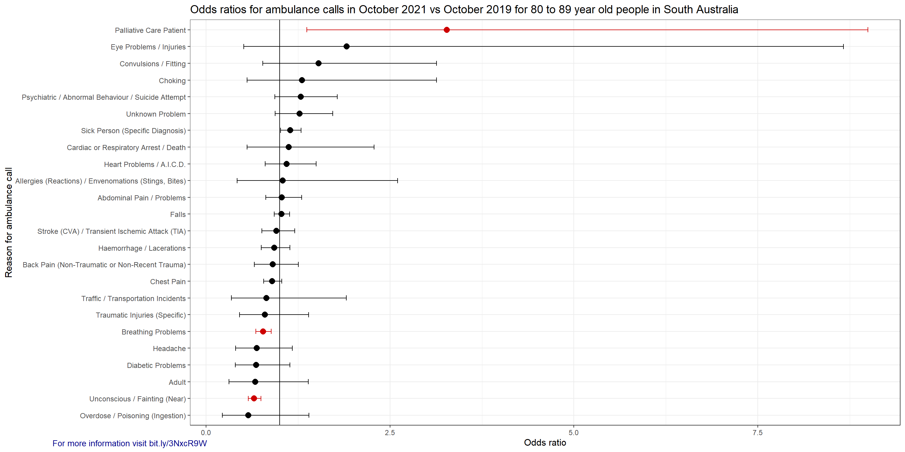
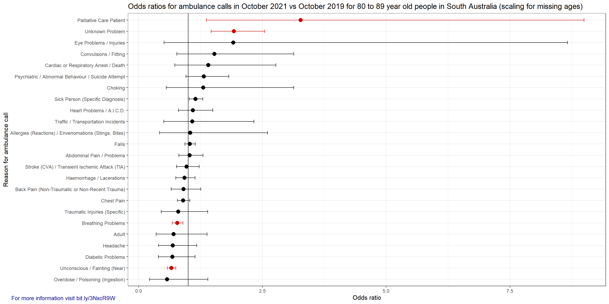
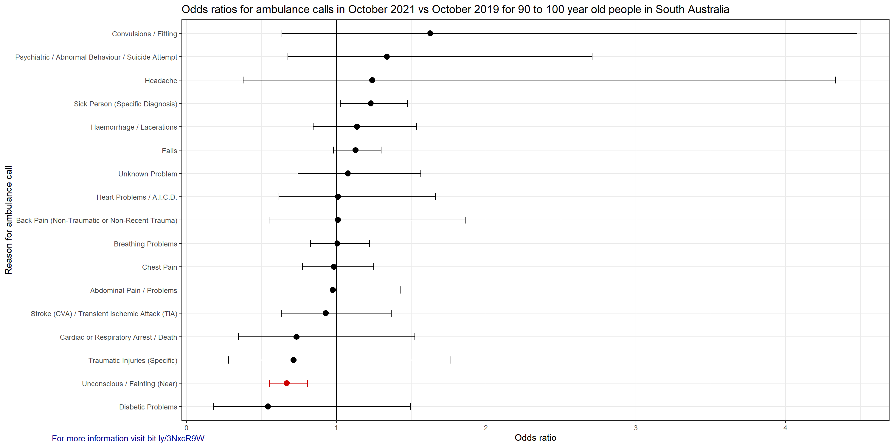
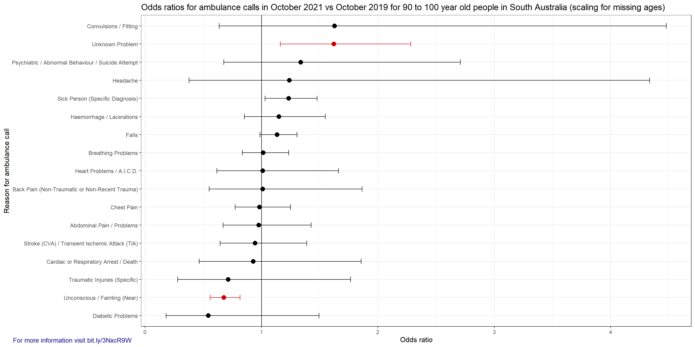

# SAAS_FOI
Analysis of data from the South Australian Ambulance Service

### Table of Contents
[Introduction](#introduction) 
[Comparing ambulance calls in October 2021 with October 2019](#comparing-ambulance-calls-in-october-2021-with-october-2019) 
[How this dataset was analysed](#how-this-dataset-was-analysed) 
[How to read the graphs](#how-to-read-the-graphs) 
[The graphs](#the-graphs) 

See also: [Accessible Adverse Event Notification (making the Database of Adverse Event Notifications accessible)](https://github.com/AccAEN/AccessibleAdverseEventNotification/blob/main/README.md)

## Introduction

There are a few locations in the world that kept SARS-CoV-2 from spreading through the community. South Australia was one of those locations with only [918 cases to 29 October 2021](https://web.archive.org/web/20211029221020/https://www.covid-19.sa.gov.au/home/dashboard) in a [population of 1.77 million](https://www.abs.gov.au/statistics/people/population/national-state-and-territory-population/latest-release). The vast majority of those cases were from people arriving in the state and not community transmission. The spread in the community didn't really [start until mid-December 2021](https://archive.ph/IpWDN#32%). This means that South Australia has a fairly unusual situation where any adverse events from the vaccine would not be confounded by exposure to the virus.

## Comparing ambulance calls in October 2021 with October 2019

The South Australian Ambulance Service has provided ambulance call out data for October 2019 and October 2021 via Freedom of Information request FOI-2021-00201. The year of 2019 was the most recent 'normal' year and used as the reference. The month of October was chosen due to a large number of 12 to 18 year old children receiving the second dose of a COVID-19 vaccine. Unfortunately it was not possible to get a larger dataset in a timely fashion.

It is difficult to know what the cause of an increase in ambulance calls would be. It is possible that it could be related to vaccine injuries, or it could be from other causes, so care needs to be taken in drawing conclusions from this dataset.

### How this dataset was analysed

The dataset used in analysis can be found in the [data directory of this repository](data/)

The age information needed a lot of work. Some of the cleaning could be done by automated processes, but a noticeable portion needed manual intervention. 

Some calls are repeated a few minutes after the first call. These repeat calls needed to be removed without removing valid new calls. If a call was received within 30 minutes of another call which had the same age, sex and event profile then the duplicate call was removed. The threshold of 30 minutes seemed like a reasonable balance between excluding most of the duplicate calls and not excluding real calls with the same profile.

Population information for each age group at the two time points was collected from [the ABS](https://www.abs.gov.au/statistics/people/population/national-state-and-territory-population/sep-2021/3101054.xlsx) (ABS data is actually 30 June estimate, but the relative number of 30 June 2019 to 30 June 2021 should be a similar ratio for October 2019 to October 2021.

Analysis was performed in R. All ambulance callouts related to other agencies were removed because they didn't appear to add any useful information (e.g. an event labelled TRANSFER, TRANSPORT etc.). Information was extracted for a selected age group. If an event (e.g. a Chest Pain call) occurred three times or less in a month in October 2019 or October 2021 in the selected age group, then it was removed. If the sum of calls for a particular event (add both Oct 2019 and Oct 2021) was less than 10 times then it was removed. This kept the error bars from being so large that useful information could not be observed. Fisher's exact test (fisher.test) was used to perform the analysis, which calculated the odds ratio, the upper and lower limits for the 95% confidence interval and the p-value. The p-value was adjusted for multiple comparison using the Benjamini & Hochberg adjustment. Graphs were generated using ggplot2.

There were a large number of missing entries in the AGE column of the source data. An attempt was made to determine what those missing entries might have been by finding the total number of entries for an event and the number of entries for that event which had age information. A scaling factor was applied to attempt to correct for this, but there are potential problems with this. It might be more likely that someone calling an ambulance for a 16 year old having a stroke would know the age of the patient than someone calling for a much older patient.

Please be aware that the normal seasonal influenza did not occur over the last two years in South Australia, so there will be some unusual distortions in the health profile of the extremely old population.

There are some differences that are unexpected. A significant decrease in 'Unconscious / Fainting (Near)' in some age groups and a significant increase in 'Traumatic Injuries (Specific)' in some age groups. A possible explanation for the significantly lower numbers of 'Unconscious / Fainting (Near)' events could be due to the [unusually hot October in 2019]( https://web.archive.org/web/20191207165754/http://www.bom.gov.au/climate/dwo/201910/html/IDCJDW5081.201910.shtml) and the [relatively mild October in 2021]( https://web.archive.org/web/20220330022258/http://www.bom.gov.au/climate/dwo/202110/html/IDCJDW5081.202110.shtml).

### How to read the graphs

If an odds ratio is above one then there was an increased chance of that event occurring, and below one means a decreased chance. For example, if the odds ratio of 'Convulsions / Fitting' in 12 to 17 year old children was 2.2 then the chance of a call being made for a 12 to 17 year old for 'Convulsions / Fitting' in October 2021 was 2.2 times the rate of October 2019 (increased by 120%). For this specific category there were 31 calls in October 2019 and 70 calls in October 2021. The ABS estimate for the population in this age group was 120,738 and 124,272 in October 2019 and 2021 respectively. The error bars show the 95% confidence interval and red indicates statistical significance (p < 0.05). Very wide error bars usually indicate a very small number of events occurred (for example, in October 2019 there were four ambulance calls for 'Stroke / TIA', but eight in October 2021 for 12 to 17 year old children). These graphs don't indicate the cause of the differences in ambulance calls in the two compared months.

### The graphs

